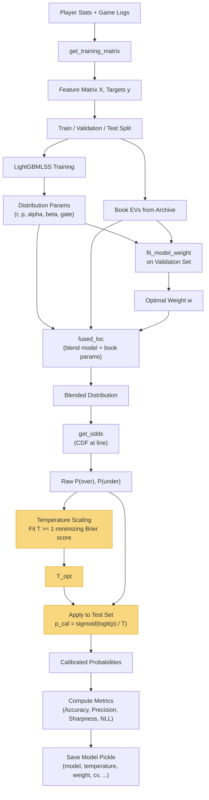
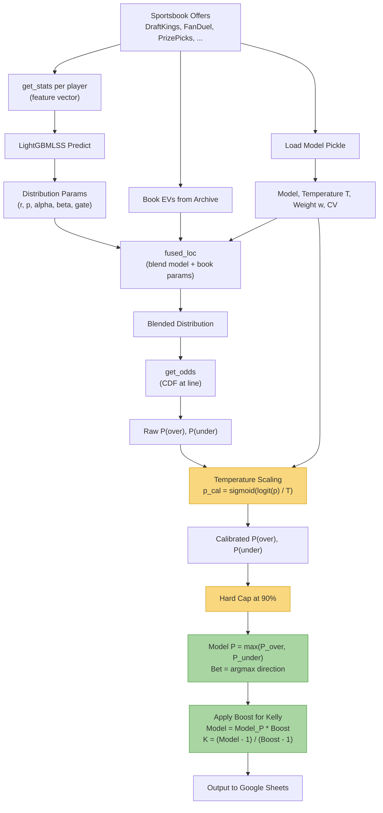

# Pipeline Diagrams

## Training Pipeline

## Inference Pipeline

### Legend

- Yellow: Calibration steps (temperature scaling, confidence cap)
- Green: Confidence and bet sizing (pure probability kept separate from boost)
