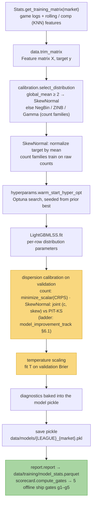
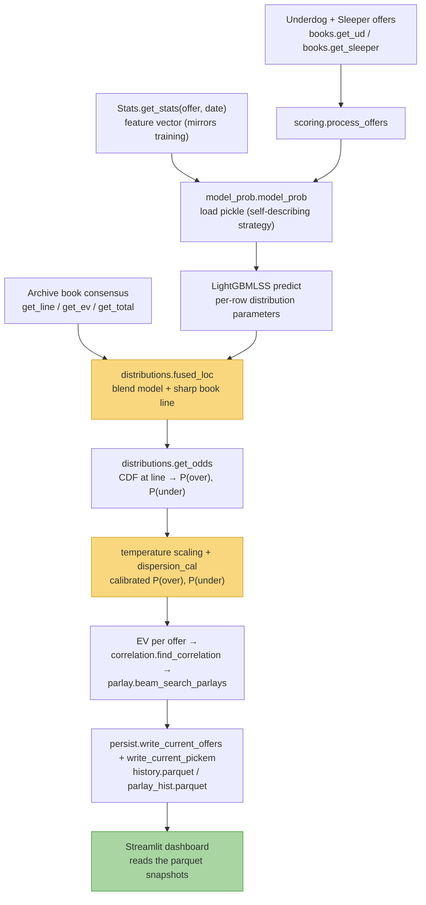

# Pipeline Diagrams

High-level flowcharts for the training and inference pipelines. The authoritative
narrative is [CONTRIBUTING.md](../CONTRIBUTING.md) §Data Flow and §Modifying the
Training Pipeline; the offline ship-gate detail is in
[docs/handoffs/model_improvement_track.md](handoffs/model_improvement_track.md) and
[docs/ship_gate.md](ship_gate.md).

## Training Pipeline (`meditate` → `training/pipeline.py:train_market`)

```mermaid
flowchart TD
    A["Stats.get_training_matrix(market)<br/>game logs + rolling / comp (KNN) features"] --> B["data.trim_matrix<br/>Feature matrix X, target y"]
    B --> C["calibration.select_distribution<br/>global_mean ≥ 2 → SkewNormal<br/>else NegBin / ZINB / Gamma (count families)"]
    C --> D["SkewNormal: normalize target by mean<br/>count families train on raw counts"]
    D --> E["hyperparams.warm_start_hyper_opt<br/>Optuna search, seeded from prior best"]
    E --> F["LightGBMLSS.fit<br/>per-row distribution parameters"]
    F --> G["dispersion calibration on validation<br/>count: minimize_scalar(CRPS) · SkewNormal: joint (c, skew) vs PIT-KS<br/>(ladder: model_improvement_track §6.1)"]
    G --> H["temperature scaling<br/>fit T on validation Brier"]
    H --> I["diagnostics baked into the model pickle"]
    I --> J["save pickle<br/>data/models/{LEAGUE}_{market}.pkl"]
    J --> K["report.report → data/training/model_stats.parquet<br/>scorecard.compute_gates → 5 offline ship gates g1–g5"]

    style G fill:#f9d77e,stroke:#d4a017
    style H fill:#f9d77e,stroke:#d4a017
    style K fill:#a8d5a2,stroke:#4a9e3f
```

## Inference Pipeline (`prophecize` → `prediction/`)

```mermaid
flowchart TD
    A["Underdog + Sleeper offers<br/>books.get_ud / books.get_sleeper"] --> B["scoring.process_offers"]
    S["Stats.get_stats(offer, date)<br/>feature vector (mirrors training)"] --> C
    B --> C["model_prob.model_prob<br/>load pickle (self-describing strategy)"]
    C --> D["LightGBMLSS predict<br/>per-row distribution parameters"]
    AR["Archive book consensus<br/>get_line / get_ev / get_total"] --> E
    D --> E["distributions.fused_loc<br/>blend model + sharp book line"]
    E --> F["distributions.get_odds<br/>CDF at line → P(over), P(under)"]
    F --> G["temperature scaling + dispersion_cal<br/>calibrated P(over), P(under)"]
    G --> H["EV per offer →<br/>correlation.find_correlation →<br/>parlay.beam_search_parlays"]
    H --> I["persist.write_current_offers + write_current_pickem<br/>history.parquet / parlay_hist.parquet"]
    I --> J["Streamlit dashboard<br/>reads the parquet snapshots"]

    style E fill:#f9d77e,stroke:#d4a017
    style G fill:#f9d77e,stroke:#d4a017
    style J fill:#a8d5a2,stroke:#4a9e3f
```

### Legend

- Yellow: blending + calibration (book blend, temperature / dispersion).
- Green: outputs — the offline ship gates (training) and the parquet snapshots the
  dashboard reads (inference). `prophecize` no longer exports to Google Sheets; the
  dashboard is the review surface and `strategies/underdog_pickem.py` writes the
  Pick'em recommendations.
