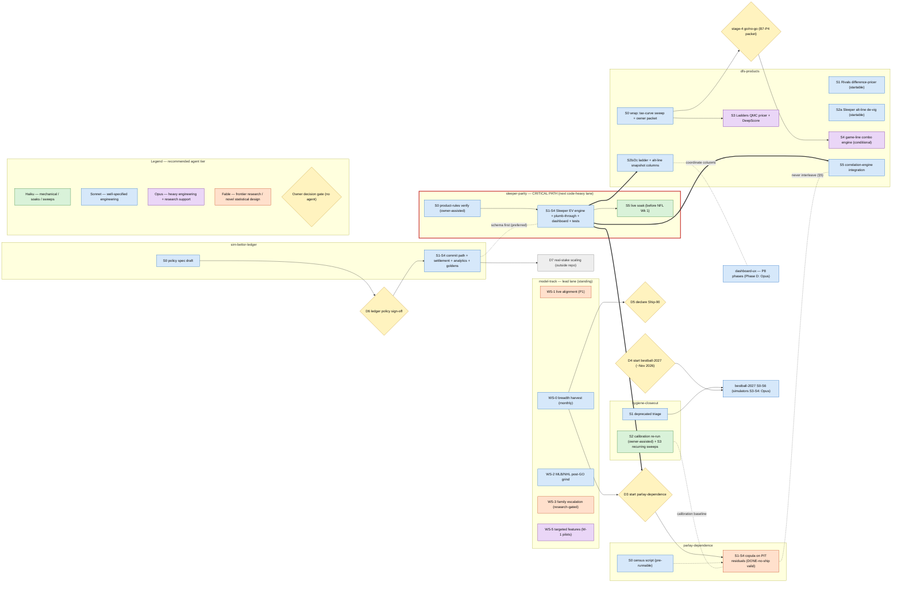

# Sportstradamus Roadmap (v3)

Master index for the program. This doc holds exactly four kinds of fact:
the swimlane index, cross-lane constraints and decision gates, the deferred
register, and the doc map. It **never** holds live counts, gate thresholds,
lever detail, stage detail, or per-cell anything — those have canonical homes
(§9); restating them here is a bug. §4.1 renders the same facts as a
build-path diagram — a visual index, never a fifth kind of fact. Predecessor:
[`archive/sportstradamus_roadmap_v2.md`](archive/sportstradamus_roadmap_v2.md)
(archived; status claims stale).

## 1. Mission

A full toolset to profit on DFS pick'em apps — **Underdog and Sleeper** — by
handing their parlay builders better-calibrated probabilities than the apps'
implied prices (the lens of
[`model_improvement_track.md`](handoffs/model_improvement_track.md) §1: beat the apps,
blend with the sharp books, calibration is the product). Model correctness
leads; draft products (Best Ball) target the 2027 season. Non-normative
background vision: [`underdog_edge_suite.md`](underdog_edge_suite.md).

## 2. Ground truth — run, don't read

Numbers drift on every ship. Derive them; never trust prose (including this
file's):

```bash
# Shipped counts per league (withheld / devel / main)
python3 -c "import json,collections; m=json.load(open('src/sportstradamus/data/config/stat_meta.json')); [print(l, dict(collections.Counter(c['shipped'] for c in v.values()))) for l,v in m.items()]"

# Per-cell gate numbers (g1–g6, ship) — fresh after every meditate
ls -la src/sportstradamus/data/training/model_stats.csv

# What production tracks
git fetch origin && git log --oneline origin/devel -5
```

Breadth targets (D3/D5 inputs) live in
[`model_improvement_track.md`](handoffs/model_improvement_track.md) §1 — don't
restate them here. MLB/NHL: D1/D2 = GO; their post-GO grind runs in
model-track WS-2.

## 3. Foundations already shipped

Stable, verified-in-code one-liners (everything in-flight lives in brief
ledgers, not here):

- Kelly sizing — `strategies/kelly.py` + `kelly` CLI (fractional, shrinkage
  blend, cvxpy portfolio).
- Underdog pick'em engine — `strategies/underdog_pickem.py` + `pickem-build`
  CLI → recommendations YAML; Rivals folded in.
- Parlay pricing — `prediction/parlay.py` (beam search) + `prediction/payouts.py`
  (`contest_variant` payout tables/curves) + `prediction/joint.py` (Gaussian
  copula, push-aware EV, PSD repair — the swappable Σ seam; ARCHITECTURE
  §Stable Seams).
- CLV — `clv.py` wired into `nightly.py:reflect`; per-segment summaries.
- Retrospective strategy backtest — `strategies/profit_sim.py` +
  `pages/6_Stats_Profit_Sim.py` (Monte Carlo over resolved history).
- Structured JSON logging — `helpers/logging.py`; fake-mode end-to-end
  integration test — `tests/integration/test_end_to_end.py`.
- Dashboard — `pages/` incl. Pick'em and Parlays recommendation views reading
  parquet snapshots only.
- Model lifecycle — six offline gates ([`ship_gate.md`](ship_gate.md)),
  live Gate-2 graduation (`check-graduation`, `gate-status` cron),
  `stat_meta.json` `shipped` release control (CONTRIBUTING §Shipping).

## 4. Swimlane index

Lanes run **in parallel**. Any lane not BLOCKED is fair game — pick by season,
owner call, or appetite; pivoting lanes when stuck is the intended motion, not
an exception. A session works one lane and reads that lane's brief.

| Lane | Mission | Status | Entry gate | Brief |
|---|---|---|---|---|
| `model-track` | Profit-first: beat the DFS apps/mispriced books live (WS-1) + standing breadth harvest → D3/D5 + MLB/NHL post-GO grind (WS-2); the lead lane | ACTIVE | — | [model_improvement_track.md](handoffs/model_improvement_track.md) |
| `sim-bettor-ledger` | Pre-registered paper-trading ledger + circuit breakers | ACTIVE | — (D6 resolved; stage 1 commit path next) | [handoffs/sim-bettor-ledger.md](handoffs/sim-bettor-ledger.md) |
| `sleeper-parity` | Full Sleeper decision-layer parity | ACTIVE — **CRITICAL PATH** (blocks D3 + dfs-products 2b/2c/5); stages 0-4 complete on `feature/sleeper-parity`, PR to devel pending merge; target merge ~Aug 2026 (pre NFL Wk 1) | devel merge → unblocks stage 5 live soak | [handoffs/sleeper-parity.md](handoffs/sleeper-parity.md) |
| `parlay-dependence` | Copula on PIT residuals — biggest product-EV lever | BLOCKED (on: D3) | D3 | [handoffs/parlay-dependence.md](handoffs/parlay-dependence.md) |
| `dfs-products` | New bet-type decision engines: game-line combos (verify-first) + Underdog Ladders + alt-line hardening + Rivals difference-pricer | ACTIVE | — (stage 0 near-done; 1/2a startable now; 2b/2c/5 queue per §5; stage 4 owner go/no-go) | [handoffs/dfs-products.md](handoffs/dfs-products.md) |
| `mlb-nhl-activation` | Activated both leagues (D1/D2 = GO); post-GO grind runs in model-track WS-2; brief keeps the per-league detail | DONE (absorbed: model-track WS-2) | — | [archive/mlb-nhl-activation.md](archive/mlb-nhl-activation.md) |
| `dashboard-ux` | Narrative-first dashboard: six surfaces, slip builder, receipts, celestial skin | ACTIVE | — | [handoffs/dashboard-ux.md](handoffs/dashboard-ux.md) |
| `bestball-2027` | Draft products for the 2027 season | BLOCKED (on: D4) | D4 | [handoffs/bestball-2027.md](handoffs/bestball-2027.md) |
| `hygiene-closeout` | Triage, calibration re-run, drift fixes, recurring checks | ACTIVE | — | [handoffs/hygiene-closeout.md](handoffs/hygiene-closeout.md) |
| `skewnormal-hessian` | Non-finite hessians in the centered SkewNormal head; blocks the numpy 2 pin | ACTIVE | — (stage 0 decides whether the early boosting stop is damage or convergence) | [handoffs/skewnormal-hessian-float32.md](handoffs/skewnormal-hessian-float32.md) |

### 4.1 Build path (visual index)

Solid arrows are hard blockers; thick arrows are the critical path; dotted
lines are advisory (preferred ordering / coordination / never-interleave).
Node color = recommended Claude agent tier for the work's complexity
(legend); yellow diamonds are owner-only decision gates — no agent flips
them. Statuses live in the §4 table and counts/thresholds in their §9
homes; update this diagram only when a dependency edge, stage, or gate
appears or disappears.



## 5. Hard constraints (the only serialization)

Everything not listed here is pivot-free.

1. File serialization on the joint-pricing surface — **operational, not
   architectural** (the import graph is acyclic; the risk is two lanes editing
   the same files): `sleeper-parity` **before** `parlay-dependence`, never
   interleaved — both rework `prediction/joint.py` + `correlation.py` Σ
   assembly (ARCHITECTURE §Stable Seams). `dfs-products` stages touching that
   surface, `payouts.py`, `training/correlate.py`, or sleeper-parity's
   declared footprint (`prediction/cli.py`, `persist.py`, pick'em
   `strategies/`) queue behind the pair; import-only / new-module / ingestion
   / docs stages are pivot-free.
2. `parlay-dependence` needs ≥ 2 leagues at their breadth target (PITs of
   uncalibrated marginals are noise) **and** an Opus research brief in hand
   (gate D3).
3. `sim-bettor-ledger` schema lands before `sleeper-parity` finishes
   (preferred, not strict) — so Sleeper logs into the ledger from day one.
4. Review bandwidth is real: one owner. Advisory, not a rule — keep at most
   one code-heavy lane in flight beside `model-track`.

**Critical path:** `sleeper-parity` is the program's only serial chokepoint —
D3 and dfs-products 2b/2c/5 all wait on it, and its own window closes at NFL
Week 1 (Sep). Unscheduled past ~Aug, D3 and the Feb–May `parlay-dependence`
window slip a season.

### Seasonality (advisory — best windows, never a schedule)

| Window | In season | Best-fit lanes |
|---|---|---|
| Jun–Aug | WNBA, MLB | model-track live-alignment (WS-1 — WNBA is the only live feedback pre-Sep), ledger (live slates to log), MLB audit (D1 decays with the season), Sleeper parity before NFL |
| Sep–Jan | NFL, NBA, NHL | NFL cell grind (Gate-2 soak needs live games), Sleeper payoff, NHL activation if D2=GO |
| Feb–May | NBA | parlay-dependence, Ship-90, Best Ball foundations (D4) |

## 6. Change-absorption protocol

Setbacks are expected: methods fail, apps change their products, plans change.
Three failure classes, each with a standing response — failure is per-lever,
never per-operation (model_improvement_track.md §1: every lane carries more
levers than it has cells to flip).

- **Method fails** (a lever doesn't move its metric): record the verdict +
  evidence pointer in the brief's ledger, take the stage's if-it-fails branch
  or kill the stage. Never grind: two consecutive sessions with no acceptance
  criterion moving is a hard stop (brief §8).
- **Product changes** (Underdog/Sleeper payouts, rules, API shapes): every
  brief lists its volatile product assumptions with re-verify steps (brief §3).
  On drift: stop, re-verify the lane's stage-0 facts, revise the brief in
  place, resume.
- **Blocked / pivot** (external dependency, owner unavailable, season
  mismatch): append a ledger line with the reason, set the brief status to
  `BLOCKED (on: …)`, flip the §4 row here (and §4.1 only if a dependency edge
  changed), and pick another lane.

## 7. Decision gates (owner-only)

Gates resolve by owner commit. Sessions prepare decision packets; they never
flip a gate.

| Gate | Decision | Input | Window |
|---|---|---|---|
| D1 | MLB activation go/no-go | `mlb-nhl-activation` stage-0 MLB packet | RESOLVED — GO 2026-07-09 |
| D2 | NHL activation go/no-go | stage-0 NHL packet | RESOLVED — GO 2026-07-09 |
| D3 | Start `parlay-dependence` | ≥2 leagues at target + Opus research brief + sleeper-parity merged | when inputs exist |
| D4 | Start `bestball-2027` | calendar ≥ ~Nov 2026 + model-track health | before 2027 drafts open |
| D5 | Declare Ship-90 | Ship-75 targets met; [`model_improvement_track.md`](handoffs/model_improvement_track.md) §6.8 decision packet | at 75% breadth |
| D6 | Ledger policy spec v1 sign-off | `sim-bettor-ledger` stage-0 spec | RESOLVED — GO 2026-07-12 |
| D7 | Real-stake scaling | ledger CLV/ROI over a meaningful sample | outside repo scope; named so the ledger has a customer |

## 8. Deferred & not-doing register

One line + pointer each, so no session rediscovers these as gaps. Design
sketches live in the archived v2.

- **Alerts / push** — deferred; revisit only if polling cadence < ~10s, a
  websocket feed lands, or high-edge windows are demonstrably missed
  (archived v2 §4.1).
- **Streaks** — deferred; sequential-decision problem needing its own design
  pass (archived v2 §3.5). Ladders graduated to `dfs-products` (not
  sequential — lowest-shared-rung pricing; stage-0 brief in
  `archive/researcher_ladders_stage0.md`).
- **Pick'em Champions** — removed; pari-mutuel ≠ static-line arbitrage
  (archived v2 §3.4).
- **Placed-bet logging / `tracking/` package** — **replaced by**
  `sim-bettor-ledger`; do not resurrect (archived v2 §2.2/2.3).
- **Model speculative tail** — conformal ladder + CQR, CLV-CRPS dashboard,
  TabPFN-as-platform, multi-task NN, spliced/Pareto tails, MZINB — deferred
  behind breadth; pointers in model_improvement_track.md §6.6/§8 and archived
  v2 §Phase 6.
- **Streamlit → FastAPI rewrite** — only if real-time push ever becomes the
  product (archived v2 §Suggestions).
- **Empirical-vs-model ρ overlay** — Correlations Lab heatmap overlay flagging
  pairs the copula mis-prices (P8 spec §6.4).
- **Idea backlog** — archived v2 §Suggestions for Further Improvement.

## 9. Doc map (canonical homes)

| Fact | Home |
|---|---|
| Shipped counts / release surface | `src/sportstradamus/data/config/stat_meta.json` (`shipped`) |
| Gate thresholds g1–g6, Gate 2 | [`ship_gate.md`](ship_gate.md) |
| Model lever stack, per-league path, stop rules | [`model_improvement_track.md`](handoffs/model_improvement_track.md) §6–§8 |
| Per-cell gate numbers | `src/sportstradamus/data/training/model_stats.csv` (mirror of the parquet) |
| Stable code seams (import-don't-edit contracts) | `docs/ARCHITECTURE.md` §Stable Seams |
| Lane procedure, locked decisions, status | `docs/handoffs/{lane}.md` (model track: [`model_improvement_track.md`](handoffs/model_improvement_track.md)) |
| Dashboard UX design (surfaces, slip rail, taxonomy, scars) | [`dashboard_ux_redesign.md`](dashboard_ux_redesign.md) |
| Package map, league/market how-to | `docs/ARCHITECTURE.md` |
| Session law (gates, subagents, hard rules) | `CLAUDE.md` |
| Code style | `docs/STYLE_GUIDE.md` |
| History | `docs/archive/` + git |

## Changelog

- sleeper-parity stages 0-4 done (EV engine, decision-layer plumb-through, live-rail pricing, ledger integration incl. 2 push-refund bug fixes); PR to devel opened; §4 row trued.
- roadmap trued vs audit: D1/D2 RESOLVED GO; mlb-nhl lane DONE→model-track WS-2; dfs-products ACTIVE; sleeper-parity flagged CRITICAL PATH (next code-heavy lane); §4.1 build-path diagram added; §5 constraints 1+5 merged post parlay.py seam split (payouts.py + joint.py, ARCHITECTURE §Stable Seams); breadth thresholds de-duped to model-track §1; model_stats path fixed.
- dfs-products lane added (game-line combos verify-first, Ladders graduated from §8, alt-line hardening, Rivals pricer); §5 gains its serialization rule; PARLAY_AUDIT refreshed w/ dispositions; stage-0 briefs in docs/archive.
- model-track reframed profit-first: WS-1 live-alignment = P1, MLB/NHL activation folded in (ACTIVE), family research done (WS-3), copula stage-0 done (WS-4); g1–g5→g1–g6; seasonality Jun–Aug += live-alignment.
- P8 planned (spec + 6 phase plans in `docs/archive/superpowers/`, incl. D constellation shapes + E art catalog); Sheets-era data retirement folded into dashboard-ux as Phase 0; §8 gains the ρ-overlay follow-up.
- model-track lane consolidated: ship75/ship90/feature-plan/brief merged into `model_improvement_track.md`; lane row + doc map repointed.
